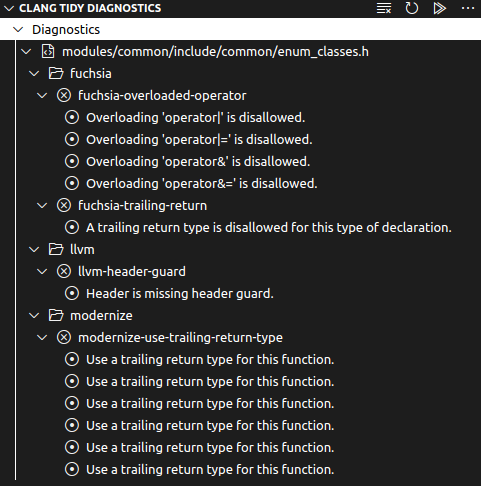

# Clang Tidy GUI

Clang Tidy GUI integrates clang-tidy into Visual Studio Code and displays all diagnostics in a convenient interface.

## Features

* Run clang-tidy from the file explorer on files or entire folders.
* View the results in a nice interface that has many convenient actions available from the context menus.
* Enable and disable specific checks.
* Results are stored on disk and therefore persist when closing VS Code.
* Configure the number of files that is analysed in parallel.

## Requirements

* This extension uses the [js-yaml](https://www.npmjs.com/package/js-yaml) package.
* You will need to install some version of [clang-tidy](https://clang.llvm.org/extra/clang-tidy).
* Your build system will need to output a `compile_commands.json` file for clang-tidy.

## Release Notes

### 1.3.0

* Added new ${cpptools.config} variable that is substituted with the selected configuration when using the Microsoft C/C++ extension.
* Fixed ${workspaceFolder} being ignored in Executable Path setting.

### 1.2.0

* Added separate path for the checks.json file to allow easier sharing of settings between projects.
* Source path now supports adding one or more subfolders.
* Fixed file filter only being applied to filename instead of full path.

### 1.1.0

* Added setting to pass extra compiler arguments to clang-tidy.
* Fixed several small bugs.

### 1.0.0

Initial release.
